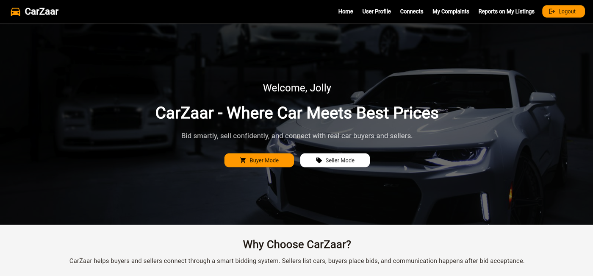
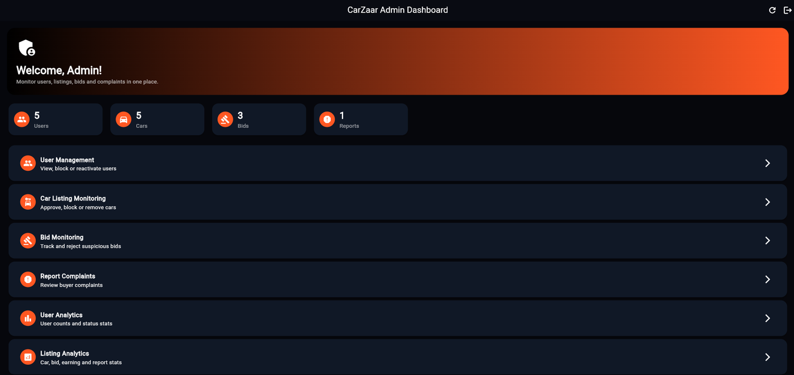
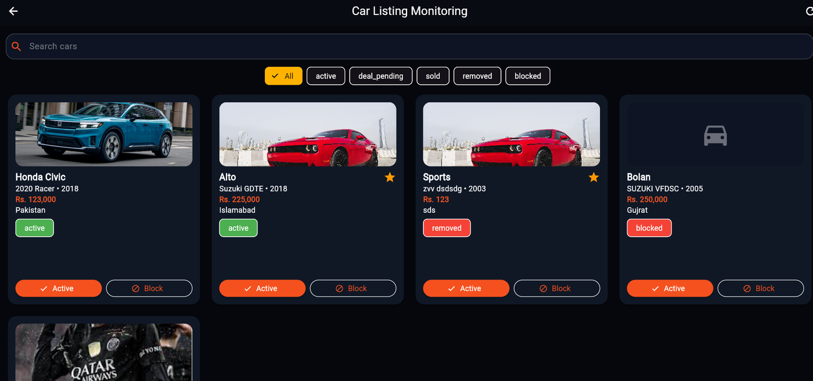

## CarZaar — Car Bidding Marketplace

Flutter | Dart | Supabase

**CarZaar** ("Where Car Meets Best Prices") is a mobile marketplace where sellers list their cars and buyers compete with bids. It was built as the final project of my **Mobile Application Development** course using **Flutter** and **Supabase** and I later performed a **security review** of both apps — the full report is included in this repository.

| App | For | What it does |
|-----|--------|-----|--------------|
| **CarZaar**  | Buyers and Sellers Mode | Browse cars, place / edit / withdraw bids, list cars, accept offers, buy "connects", report problems |
| **CarZaar Admin**  | Admin Mode | Dashboard, user management, listing and bid monitoring, complaint handling, analytics |

## Media

### User Module
<table>
  <tr>
    <td align="center" width="50%"> <b>Login</b></td>
    <td align="center" width="50%"> <b>Home – switch between Buyer and Seller mode</b></td>
  </tr>
</table>

### Admin Module
<table>
  <tr>
    <td align="center" width="50%"> <b>Dashboard – live counters &amp; modules</b></td>
    <td align="center" width="50%"> <b>Car listing monitoring – search, filter, block</b></td>
  </tr>
</table>

---

## Features

**User app**
- Sign up, log in, reset password, edit profile including profile photo
- One account, two modes — switch between **Buyer** and **Seller** from the home screen
- **Buyer:** search and browse active listings, view details, place / edit / withdraw bids, track bid status
- **Seller:** add / update / remove cars, see received bids, accept or reject bid
- **Connects wallet:** buy connects (demo payment), spend them on *featured listings* and *unlocking a seller's contact*, full transaction history
- **WhatsApp contact** once a bid is accepted and the contact is unlocked
- **Complaints:** report fake listings / sellers and track the status of your reports

**Admin app**
- Live counters for users, cars, bids and reports
- Block / activate users
- Approve or block car listings
- Monitor bids and reject suspicious ones
- Resolve or dismiss complaints
- User and listing analytics

## Security Testing

After finishing the app I reviewed both modules from an attacker's point of view. The assessment is mapped to the **OWASP Top 10**, **OWASP API Security Top 10** and **OWASP Mobile Top 10**.

## Author

Built by me as a part of final project of my **Mobile Application Development** course and I later performed a **security review** of both apps.
Feedback and suggestions are welcome, feel free to open an issue.
